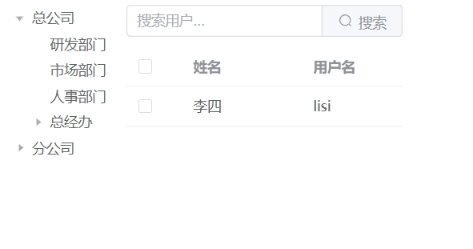

# Hixtrip FE Online

## 准备

- fork 此仓库
- 根据如下要求实现相关代码
- 完成要求
  - 提交`pull request`
  - 提供页面截图

## 需求

1. 目前已经有`src/api/user.ts` 以及 `src/api/org.ts` 两个 API
2. 需要实现如下效果界面：


> 功能要求：
- 不限 ```React``` 或者 ```Vue```
- 需要拆分 `OrgTree` 以及 `UserTable` 两个组件
  - 两个组件自己维护相关的数据。
  - 体现两个组件的互相通信。
- 组织架构根据点上级节点进行查询子级节点实现异步加载。
- 用户 ```Table ``` 数据跟据点击 ```组织架构树形节点``` 以及 ```输入搜索关键字``` 查询。
  - 需要考虑防抖节流等功能点
- 风格不限
  - 示例图仅仅是效果展示，不需要完全符合。
  - 可以使用 ```UI Framework```, 如 ```ant-design```, ```element-ui```等
  - 如果不用```UI Framework```, 可以直接用原生的```<ul> <li>```, ```<table>``` 实现，不用实现相关的CSS样式, 可以加分。

## 其他简答题

### 如何将如下的`JSON`正确解析成 `Object`
```json
{
  "userId": 111323290434354540545
}
```
#要将JSON字符串解析成对象
// JSON字符串
const jsonString = '{"userId": 111323290434354540545}';

// 使用JSON.parse()方法将JSON字符串解析成对象
const parsedObject = JSON.parse(jsonString);

### 前端需要*稳定*每隔`1s`向服务端请求`API`, 请问如何实现？

#要实现前端每隔1秒向服务端发送API请求，你可以使用JavaScript中的setInterval函数来设置一个定时器，每次触发时执行发送请求的操作
function fetchData() {
  // 发送API请求的函数
  request('api-url')
    .then(response => response.json())
    .then(data => {
      // 处理从服务端返回的数据
      console.log(data);
    })
    .catch(error => {
      // 处理可能出现的错误
      console.error('Error:', error);
    });
}

// 每隔1秒调用一次fetchData函数
const intervalId = setInterval(fetchData, 1000);


### 什么情况下，你会为你的项目引入状态管理库，比如`Redux`, `Pinia`, 可以简述一下起到了什么作用么？
#在开发Vue.js项目时，引入状态管理库有几种情况：
1、当有多个组件需要访问和修改同一份状态时，引入状态管理可以避免在不同组件间手动传递和同步状态的复杂性。
2、复杂应用状态管理，通过状态管理可以使状态流更加清晰和易于调试
3、跨页面跨组件通信
4、当应用需要持久化状态


### 为什么`ESM`与`CJS`不能兼容？
ESM和CJS是两种不同的JavaScript模块系统，ESM 使用 import 和 export 语句进行模块的导入和导出，CJS 使用 require 函数来导入模块，使用 module.exports 和 exports 对象来导出模块。
ESM 支持静态导入和动态导入，CJS 主要支持静态导入，通过 require 函数在运行时加载模块。
ESM 更倾向于在构建时解决模块依赖，而 CJS 通常在运行时解析和加载模块。
由于这些差异，直接在 ESM 环境中使用 CJS 模块，或者在 CJS 环境中使用 ESM 模块，可能会导致不兼容的问题。


# Vue 3 + TypeScript + Vite
本案例中components下有OrgTree和UserTable两个组件，模拟了两个api接口数据，进行渲染。
OrgTree组件模拟了一个组织架构树，组织架构根据点上级节点进行查询子级节点实现异步加载，当点击不同的部门时，通过$bus事件中心的on和emit方法，传递部门id给userTable组件，并调用模拟接口，返回该部门下的员工，模拟了搜索框模糊搜索功能，支持防抖。

效果界面：



